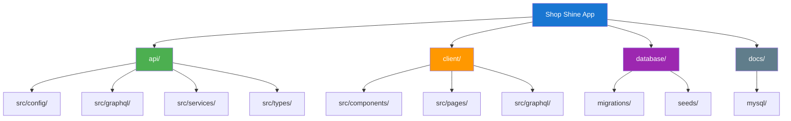
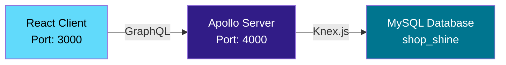
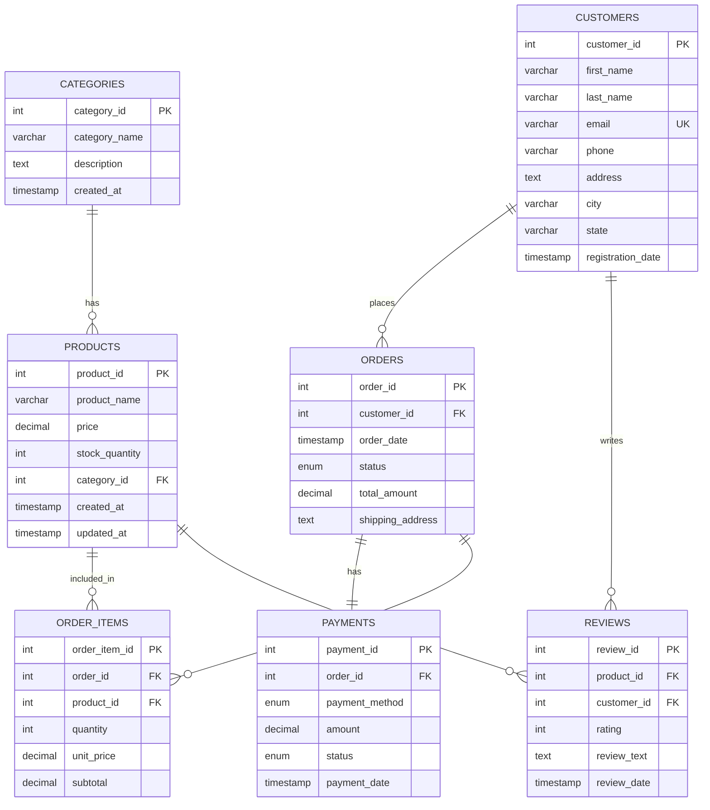
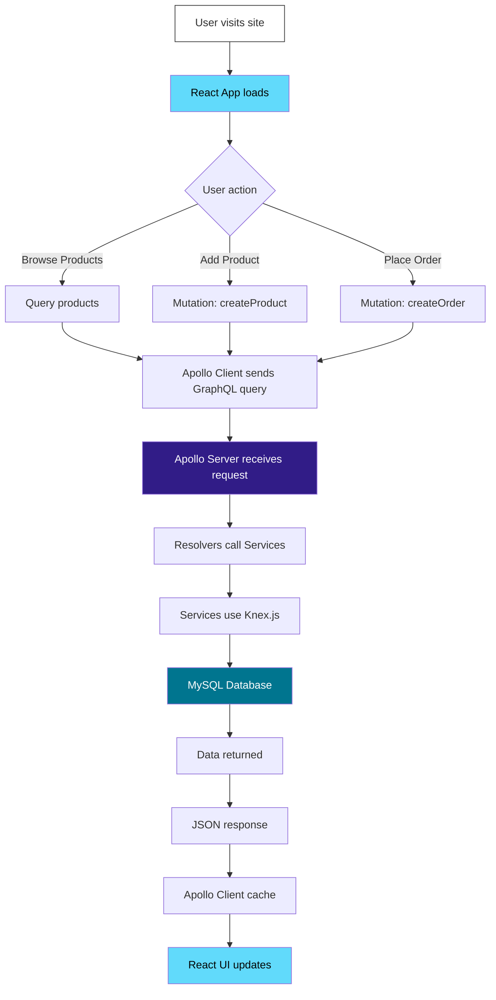

# ShopShine - E-Commerce Application

A full-stack e-commerce platform built with modern web technologies. This project demonstrates best practices in full-stack development with React, GraphQL, Node.js, and MySQL.

## 🚀 Overview

ShopShine is a complete e-commerce management system featuring product catalog, customer management, order processing, and payment tracking. Built with a modern tech stack, it provides a robust foundation for scalable e-commerce applications.

## 📋 Table of Contents

- [Tech Stack](#-tech-stack)
- [Features](#-features)
- [Prerequisites](#-prerequisites)
- [Quick Start](#-quick-start)
- [Project Structure](#-project-structure)
- [Architecture](#-architecture)
- [Development Workflow](#-development-workflow)
- [Testing the API](#-testing-the-api)
- [API Documentation](#-api-documentation)
- [Troubleshooting](#-troubleshooting)
- [Production Deployment](#-production-deployment)
- [Documentation](#-documentation)
- [Contributing](#-contributing)
- [License](#-license)

## 🛠 Tech Stack

### Backend (API)

- **Node.js** - JavaScript runtime
- **TypeScript** - Type-safe development
- **Apollo Server** - GraphQL server
- **Express** - Web framework
- **Knex.js** - SQL query builder
- **MySQL** - Relational database
- **dotenv** - Environment configuration
- **Jest** - Testing framework

### Frontend (Client)

- **React 18** - UI library
- **TypeScript** - Type safety
- **Vite** - Build tool
- **Material-UI** - Component library
- **Apollo Client** - GraphQL client
- **AG-Grid** - Data grid
- **React Hook Form** - Form management
- **Zod** - Schema validation
- **React Router** - Client-side routing

### Database

- **MySQL** - Primary database
- **Knex.js** - Migrations and seeds
- **TypeScript** - Type-safe database operations

## ✨ Features

### Product Management

- ✅ Create, Read, Update, Delete (CRUD) products
- ✅ Product categorization
- ✅ Inventory tracking
- ✅ Product reviews and ratings
- ✅ AG-Grid data table with sorting and filtering

### Customer Management

- ✅ Customer registration and profiles
- ✅ Address management
- ✅ Order history tracking
- ✅ Customer analytics

### Order Processing

- ✅ Order creation and tracking
- ✅ Order status management (pending, processing, shipped, delivered, cancelled)
- ✅ Order item details
- ✅ Real-time order updates

### Payment System

- ✅ Multiple payment methods (credit card, debit card, PayPal, bank transfer, cash)
- ✅ Payment status tracking
- ✅ Order-payment linking

### User Interface

- ✅ Modern Material-UI design
- ✅ Responsive layout
- ✅ Form validation with Zod
- ✅ Real-time data updates
- ✅ AG-Grid for data tables

## 📦 Prerequisites

Before you begin, ensure you have the following installed:

- **Node.js** >= 18.0.0 (recommended: 20.11.0)
- **MySQL** >= 8.0
- **npm** >= 9.0.0

## 🚦 Quick Start

### 1. Clone the Repository

```bash
git clone <repository-url>
cd events-apps
```

### 2. Install Dependencies

Install all project dependencies:

```bash
npm run install:all
```

Or install manually for each folder:

```bash
# Database
cd database
npm install

# API
cd ../api
npm install

# Client
cd ../client
npm install
```

### 3. Configure Database

Create a MySQL database:

```sql
CREATE DATABASE shop_shine;
```

### 4. Setup Environment Variables

#### Database (.env)

Create `database/.env`:

```env
DB_HOST=localhost
DB_USER=root
DB_PASSWORD=your_password
DB_NAME=shop_shine
DB_PORT=3306
```

#### API (.env)

Create `api/.env`:

```env
DB_HOST=localhost
DB_USER=root
DB_PASSWORD=your_password
DB_NAME=shop_shine
DB_PORT=3306

PORT=4000
NODE_ENV=development
```

**Note**: The client doesn't need an `.env` file as it connects to the API through proxy configuration.

### 5. Run Database Migrations and Seeds

Setup the database with tables and sample data:

```bash
npm run db:setup
```

Or run manually:

```bash
cd database
npm run migrate:latest
npm run seed:run
```

### 6. Start the Application

Start both API and Client servers:

```bash
npm run dev
```

Or start them separately in different terminals:

```bash
# Terminal 1 - API Server
npm run dev:api

# Terminal 2 - Client
npm run dev:client
```

### 7. Access the Application

Once both servers are running, access:

- **Client**: http://localhost:3000
- **GraphQL API**: http://localhost:4000/graphql

## 📁 Project Structure

### Visual Structure



### Detailed Structure

```
events-apps/
├── api/                    # GraphQL API Backend
│   ├── src/
│   │   ├── config/         # Database configuration
│   │   ├── graphql/
│   │   │   ├── resolvers/  # GraphQL resolvers
│   │   │   └── schemas/    # GraphQL schemas
│   │   ├── services/       # Business logic
│   │   ├── types/          # TypeScript interfaces
│   │   └── index.ts        # Server entry point
│   ├── .env
│   └── package.json
│
├── client/                 # React Frontend
│   ├── src/
│   │   ├── components/     # Reusable components
│   │   ├── pages/          # Page components
│   │   ├── graphql/        # GraphQL queries/mutations
│   │   ├── App.tsx
│   │   └── main.tsx
│   └── package.json
│
├── database/               # Database Management
│   ├── migrations/         # Knex migrations
│   ├── seeds/              # Sample data
│   ├── .env
│   └── knexfile.ts
│
├── docs/                   # Documentation
│   └── mysql/              # MySQL guides
│
├── package.json            # Root package.json
└── README.md              # This file
```

### Database Schema

The application uses the following tables:

- **categories** - Product categories
- **products** - Product catalog with pricing and inventory
- **customers** - Customer information and addresses
- **orders** - Customer orders with status tracking
- **order_items** - Line items for each order
- **payments** - Payment records with multiple payment methods
- **reviews** - Product reviews and ratings

For detailed schema information, see [docs/mysql/beginner-friendly-mysql.md](docs/mysql/beginner-friendly-mysql.md)

## 🏗 Architecture

### System Architecture



### Database Schema



### Application Flow



## 🔧 Development Workflow

### Project Scripts

```bash
# Install all dependencies
npm run install:all

# Development (both API and Client)
npm run dev

# Development (separate)
npm run dev:api
npm run dev:client

# Build for production
npm run build

# Build separate
npm run build:api
npm run build:client

# Database operations
npm run db:migrate    # Run migrations
npm run db:seed       # Run seeds
npm run db:setup      # Migrate + Seed
```

### Working with Database

```bash
# Navigate to database folder
cd database

# Create a new migration
npm run migrate:make migration_name

# Run migrations
npm run migrate:latest

# Rollback last migration
npm run migrate:rollback

# Rollback all migrations
npx knex migrate:rollback --all

# Check migration status
npx knex migrate:status

# Create a new seed
npm run seed:make seed_name

# Run seeds
npm run seed:run
```

### API Development

```bash
cd api

# Start dev server with hot reload
npm run dev

# Build for production
npm run build

# Start production server
npm start

# Run tests
npm test
```

### Client Development

```bash
cd client

# Start dev server
npm run dev

# Build for production
npm run build

# Preview production build
npm run preview

# Run ESLint
npm run lint
```

## 🧪 Testing the API

### Access GraphQL Playground

Open http://localhost:4000/graphql in your browser to access the GraphQL Playground.

### Example Queries

**Get all products:**

```graphql
query {
  products {
    product_id
    product_name
    price
    stock_quantity
    category {
      category_name
    }
  }
}
```

**Get product by ID:**

```graphql
query {
  product(product_id: 1) {
    product_name
    price
    description
    reviews {
      rating
      review_text
      customer {
        first_name
        last_name
      }
    }
  }
}
```

**Get all customers:**

```graphql
query {
  customers {
    customer_id
    first_name
    last_name
    email
    city
    state
  }
}
```

**Get customer with orders:**

```graphql
query {
  customer(customer_id: 1) {
    first_name
    last_name
    email
    orders {
      order_id
      order_date
      status
      total_amount
    }
  }
}
```

**Get all orders:**

```graphql
query {
  orders {
    order_id
    order_date
    status
    total_amount
    customer {
      first_name
      last_name
      email
    }
    order_items {
      product {
        product_name
      }
      quantity
      subtotal
    }
  }
}
```

### Example Mutations

**Create a product:**

```graphql
mutation {
  createProduct(
    input: {
      product_name: "New Product"
      description: "Product description"
      price: 99.99
      stock_quantity: 50
      category_id: 1
    }
  ) {
    product_id
    product_name
    price
  }
}
```

**Update a product:**

```graphql
mutation {
  updateProduct(
    product_id: 1
    input: { product_name: "Updated Product", price: 89.99, stock_quantity: 45 }
  ) {
    product_id
    product_name
    price
    stock_quantity
  }
}
```

**Create a customer:**

```graphql
mutation {
  createCustomer(
    input: {
      first_name: "Alice"
      last_name: "Johnson"
      email: "alice@example.com"
      phone: "555-1234"
      city: "Seattle"
      state: "WA"
    }
  ) {
    customer_id
    first_name
    last_name
    email
  }
}
```

**Create an order:**

```graphql
mutation {
  createOrder(
    input: {
      customer_id: 1
      total_amount: 199.99
      status: "pending"
      shipping_address: "123 Main St, New York, NY 10001"
    }
  ) {
    order_id
    status
    total_amount
  }
}
```

**Create a review:**

```graphql
mutation {
  createReview(
    input: {
      product_id: 1
      customer_id: 1
      rating: 5
      review_text: "Great product! Highly recommended."
    }
  ) {
    review_id
    rating
    review_text
  }
}
```

## 📚 API Documentation

### GraphQL Endpoints

The API provides comprehensive GraphQL endpoints for all entities:

#### Categories

- `categories` - Get all categories
- `category(category_id)` - Get category by ID
- `createCategory(input)` - Create new category
- `updateCategory(category_id, input)` - Update category
- `deleteCategory(category_id)` - Delete category

#### Products

- `products` - Get all products
- `product(product_id)` - Get product by ID
- `productsByCategory(category_id)` - Get products by category
- `createProduct(input)` - Create new product
- `updateProduct(product_id, input)` - Update product
- `deleteProduct(product_id)` - Delete product

#### Customers

- `customers` - Get all customers
- `customer(customer_id)` - Get customer by ID
- `customerByEmail(email)` - Get customer by email
- `createCustomer(input)` - Create new customer
- `updateCustomer(customer_id, input)` - Update customer
- `deleteCustomer(customer_id)` - Delete customer

#### Orders

- `orders` - Get all orders
- `order(order_id)` - Get order by ID
- `ordersByCustomer(customer_id)` - Get orders by customer
- `createOrder(input)` - Create new order
- `updateOrder(order_id, input)` - Update order
- `deleteOrder(order_id)` - Delete order

#### Order Items

- `orderItems` - Get all order items
- `orderItem(order_item_id)` - Get order item by ID
- `orderItemsByOrder(order_id)` - Get order items by order
- `createOrderItem(input)` - Create new order item
- `updateOrderItem(order_item_id, input)` - Update order item
- `deleteOrderItem(order_item_id)` - Delete order item

#### Payments

- `payments` - Get all payments
- `payment(payment_id)` - Get payment by ID
- `paymentByOrder(order_id)` - Get payment by order
- `createPayment(input)` - Create new payment
- `updatePayment(payment_id, input)` - Update payment
- `deletePayment(payment_id)` - Delete payment

#### Reviews

- `reviews` - Get all reviews
- `review(review_id)` - Get review by ID
- `reviewsByProduct(product_id)` - Get reviews by product
- `reviewsByCustomer(customer_id)` - Get reviews by customer
- `createReview(input)` - Create new review
- `updateReview(review_id, input)` - Update review
- `deleteReview(review_id)` - Delete review

For complete API documentation, see [api/README.md](api/README.md)

## 🔍 Troubleshooting

### Database Connection Error

If you encounter database connection errors:

- ✅ Verify MySQL is running: `mysql --version`
- ✅ Check database credentials in `.env` files
- ✅ Ensure `shop_shine` database exists
- ✅ Verify MySQL user has proper permissions
- ✅ Check that MySQL is listening on port 3306

```bash
# Test MySQL connection
mysql -u root -p -e "SHOW DATABASES;"
```

### Port Already in Use

If port 3000 or 4000 is already in use:

**Change API port:**

Edit `api/.env`:

```env
PORT=4001
```

**Change client port:**

Edit `client/vite.config.ts`:

```typescript
server: {
  port: 3001;
}
```

### Migration Errors

```bash
# Check migration status
cd database
npx knex migrate:status

# Reset database (WARNING: Deletes all data)
npx knex migrate:rollback --all
npm run migrate:latest
npm run seed:run
```

### Module Not Found Errors

```bash
# Clear node_modules and reinstall
rm -rf node_modules package-lock.json
rm -rf api/node_modules api/package-lock.json
rm -rf client/node_modules client/package-lock.json
rm -rf database/node_modules database/package-lock.json

npm run install:all
```

### GraphQL Query Errors

- Check that the API server is running on port 4000
- Verify database migrations have been run
- Check browser console for detailed error messages
- Verify GraphQL schema matches your queries

### Build Errors

```bash
# API build errors
cd api
npm run build

# Client build errors
cd client
npm run build
```

## 🚀 Production Deployment

### Build for Production

```bash
# Build all
npm run build

# Or build separately
npm run build:api
npm run build:client
```

### Environment Variables

Set production environment variables:

**API (.env):**

```env
DB_HOST=your_production_host
DB_USER=your_production_user
DB_PASSWORD=your_production_password
DB_NAME=shop_shine
DB_PORT=3306

PORT=4000
NODE_ENV=production
```

### Running in Production

**API Server:**

```bash
cd api
npm start
```

**Client:**

The client build creates static files in `client/dist/`:

```bash
# Option 1: Use Vite preview
cd client
npm run preview

# Option 2: Serve with a web server (nginx, Apache, etc.)
# Copy the dist folder to your web server
```

### Database Migration in Production

```bash
cd database
npm run migrate:latest
```

**Important:** Never run seeds in production unless you want to reset to sample data.

### Deployment Checklist

- [ ] Update all `.env` files with production credentials
- [ ] Set `NODE_ENV=production`
- [ ] Run database migrations
- [ ] Build both API and client
- [ ] Test all endpoints
- [ ] Setup SSL certificates
- [ ] Configure CORS for production domain
- [ ] Setup proper logging
- [ ] Configure backup strategy
- [ ] Monitor server resources

## 📖 Documentation

- [API Documentation](api/README.md) - Complete API reference
- [Client Documentation](client/README.md) - Frontend documentation
- [Database Documentation](database/README.md) - Database schema and migrations
- [MySQL Learning Guide](docs/mysql/beginner-friendly-mysql.md) - Comprehensive MySQL tutorial

## 👥 Contributing

Contributions are welcome! Please follow these steps:

1. Fork the repository
2. Create a feature branch (`git checkout -b feature/amazing-feature`)
3. Commit your changes (`git commit -m 'Add some amazing feature'`)
4. Push to the branch (`git push origin feature/amazing-feature`)
5. Open a Pull Request

## 📝 License

This project is licensed under the ISC License.

## 🙏 Acknowledgments

- [MySQL Documentation](https://dev.mysql.com/doc/)
- [Apollo GraphQL](https://www.apollographql.com/)
- [Material-UI](https://mui.com/)
- [AG-Grid](https://www.ag-grid.com/)
- [React Community](https://react.dev/)
- [Knex.js](https://knexjs.org/)
- [Vite](https://vitejs.dev/)

---

**Built with ❤️ using modern web technologies**

For questions or support, please open an issue in the repository.
