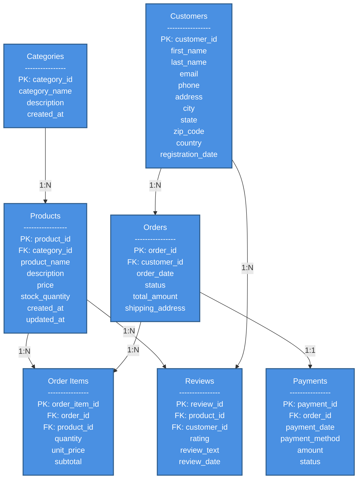
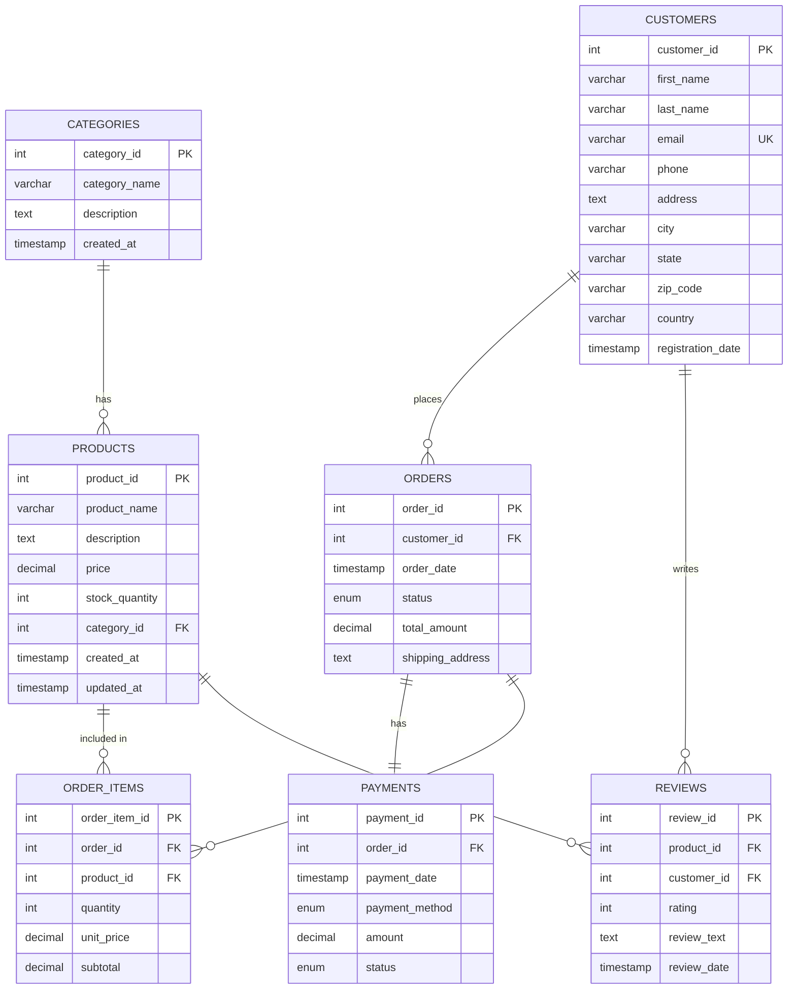

# 📚 Complete MySQL Learning Guide - From Scratch

> A beginner-friendly, hands-on guide to mastering MySQL with practical examples using MySQL Workbench

## Table of Contents

1. [Introduction](#introduction)
2. [Step-by-Step Learning Path](#learning-path)
3. [SQL Basics](#sql-basics)
4. [Database and Schema Design](#database-and-schema-design)
5. [CRUD Operations](#crud-operations)
6. [Filtering and Sorting](#filtering-and-sorting)
7. [Joins and Relationships](#joins-and-relationships)
8. [Aggregation Functions](#aggregation-functions)
9. [Indexes and Constraints](#indexes-and-constraints)
10. [Transactions](#transactions)
11. [Views](#views)
12. [Stored Routines](#stored-routines)
13. [User Management](#user-management)
14. [Backup and Recovery](#backup-and-recovery)
15. [Best Practices](#best-practices)

---

## Introduction

Welcome to your MySQL journey! This guide will take you from complete beginner to confident MySQL user. All examples are designed to run directly in MySQL Workbench.

**What You'll Build**: A complete e-commerce database system called `shop_shine` with customers, orders, products, and more.

---

## Learning Path

Here's your step-by-step learning journey:

1. **Week 1**: SQL Basics, Database Creation, Simple Queries
2. **Week 2**: CRUD Operations, Filtering, Sorting
3. **Week 3**: Joins, Relationships, Complex Queries
4. **Week 4**: Aggregations, Indexes, Performance
5. **Week 5**: Transactions, Views, Stored Procedures
6. **Week 6**: User Management, Backup, Advanced Topics

---

## SQL Basics

### Understanding SQL

SQL (Structured Query Language) is used to communicate with databases. There are several types of SQL commands:

- **DDL** (Data Definition Language): CREATE, ALTER, DROP
- **DML** (Data Manipulation Language): INSERT, UPDATE, DELETE
- **DQL** (Data Query Language): SELECT
- **DCL** (Data Control Language): GRANT, REVOKE
- **TCL** (Transaction Control Language): COMMIT, ROLLBACK

### Basic Syntax Rules

```sql
-- Comments start with two dashes
/* Multi-line
   comments use slash-asterisk */

-- SQL statements end with semicolon
-- SQL is case-insensitive (but UPPERCASE for keywords is convention)
-- String values use single quotes
```

---

## Database and Schema Design

### Step 1: Create Database

```sql
-- Create the shop_shine database
CREATE DATABASE IF NOT EXISTS shop_shine;

-- Use the database
USE shop_shine;

-- View all databases
SHOW DATABASES;
```

### Step 2: Design Schema

Our `shop_shine` e-commerce system will have these tables:

- `customers`: Store customer information
- `products`: Store product catalog
- `categories`: Product categories
- `orders`: Customer orders
- `order_items`: Items in each order
- `payments`: Payment information
- `reviews`: Product reviews

### Entity Relationship Diagram

Here's a visual representation of our database structure and relationships:



**Relationship Descriptions:**

- **Categories → Products**: One category can have many products (1:N)
- **Customers → Orders**: One customer can place many orders (1:N)
- **Customers → Reviews**: One customer can write many reviews (1:N)
- **Orders → Order Items**: One order can contain many items (1:N)
- **Orders → Payments**: One order has one payment (1:1)
- **Products → Order Items**: One product can appear in many order items (1:N)
- **Products → Reviews**: One product can have many reviews (1:N)

### Alternative ER Diagram (Traditional Notation)



**Cardinality Legend:**

- `||--o{` : One to many (1:N)
- `||--||` : One to one (1:1)
- `}o--o{` : Many to many (N:M)

### Step 3: Create Tables

```sql
-- Create categories table
CREATE TABLE categories (
    category_id INT AUTO_INCREMENT PRIMARY KEY,
    category_name VARCHAR(100) NOT NULL,
    description TEXT,
    created_at TIMESTAMP DEFAULT CURRENT_TIMESTAMP
);

-- Create products table
CREATE TABLE products (
    product_id INT AUTO_INCREMENT PRIMARY KEY,
    product_name VARCHAR(200) NOT NULL,
    description TEXT,
    price DECIMAL(10, 2) NOT NULL,
    stock_quantity INT DEFAULT 0,
    category_id INT,
    created_at TIMESTAMP DEFAULT CURRENT_TIMESTAMP,
    updated_at TIMESTAMP DEFAULT CURRENT_TIMESTAMP ON UPDATE CURRENT_TIMESTAMP,
    FOREIGN KEY (category_id) REFERENCES categories(category_id)
);

-- Create customers table
CREATE TABLE customers (
    customer_id INT AUTO_INCREMENT PRIMARY KEY,
    first_name VARCHAR(50) NOT NULL,
    last_name VARCHAR(50) NOT NULL,
    email VARCHAR(100) UNIQUE NOT NULL,
    phone VARCHAR(20),
    address TEXT,
    city VARCHAR(50),
    state VARCHAR(50),
    zip_code VARCHAR(10),
    country VARCHAR(50) DEFAULT 'USA',
    registration_date TIMESTAMP DEFAULT CURRENT_TIMESTAMP
);

-- Create orders table
CREATE TABLE orders (
    order_id INT AUTO_INCREMENT PRIMARY KEY,
    customer_id INT NOT NULL,
    order_date TIMESTAMP DEFAULT CURRENT_TIMESTAMP,
    status ENUM('pending', 'processing', 'shipped', 'delivered', 'cancelled') DEFAULT 'pending',
    total_amount DECIMAL(10, 2) DEFAULT 0.00,
    shipping_address TEXT,
    FOREIGN KEY (customer_id) REFERENCES customers(customer_id)
);

-- Create order_items table
CREATE TABLE order_items (
    order_item_id INT AUTO_INCREMENT PRIMARY KEY,
    order_id INT NOT NULL,
    product_id INT NOT NULL,
    quantity INT NOT NULL,
    unit_price DECIMAL(10, 2) NOT NULL,
    subtotal DECIMAL(10, 2) NOT NULL,
    FOREIGN KEY (order_id) REFERENCES orders(order_id),
    FOREIGN KEY (product_id) REFERENCES products(product_id)
);

-- Create payments table
CREATE TABLE payments (
    payment_id INT AUTO_INCREMENT PRIMARY KEY,
    order_id INT NOT NULL,
    payment_date TIMESTAMP DEFAULT CURRENT_TIMESTAMP,
    payment_method ENUM('credit_card', 'debit_card', 'paypal', 'bank_transfer', 'cash') NOT NULL,
    amount DECIMAL(10, 2) NOT NULL,
    status ENUM('pending', 'completed', 'failed', 'refunded') DEFAULT 'pending',
    FOREIGN KEY (order_id) REFERENCES orders(order_id)
);

-- Create reviews table
CREATE TABLE reviews (
    review_id INT AUTO_INCREMENT PRIMARY KEY,
    product_id INT NOT NULL,
    customer_id INT NOT NULL,
    rating INT CHECK (rating >= 1 AND rating <= 5),
    review_text TEXT,
    review_date TIMESTAMP DEFAULT CURRENT_TIMESTAMP,
    FOREIGN KEY (product_id) REFERENCES products(product_id),
    FOREIGN KEY (customer_id) REFERENCES customers(customer_id)
);

-- View all tables
SHOW TABLES;

-- View table structure
DESCRIBE customers;
DESCRIBE products;
DESCRIBE orders;
```

---

## CRUD Operations

CRUD stands for: **C**reate, **R**ead, **U**pdate, **D**elete

### CREATE (INSERT)

```sql
-- Insert categories
INSERT INTO categories (category_name, description) VALUES
('Electronics', 'Electronic devices and accessories'),
('Clothing', 'Men and women clothing'),
('Books', 'Books and publications'),
('Home & Garden', 'Home improvement and garden supplies'),
('Sports', 'Sports equipment and accessories');

-- Insert products
INSERT INTO products (product_name, description, price, stock_quantity, category_id) VALUES
('Laptop Pro 15', 'High-performance laptop with 16GB RAM', 1299.99, 50, 1),
('Wireless Mouse', 'Ergonomic wireless mouse', 29.99, 200, 1),
('Cotton T-Shirt', 'Comfortable cotton t-shirt', 19.99, 150, 2),
('Denim Jeans', 'Classic blue denim jeans', 49.99, 100, 2),
('Python Programming', 'Learn Python from scratch', 39.99, 75, 3),
('Garden Tools Set', 'Complete set of garden tools', 89.99, 30, 4),
('Yoga Mat', 'Non-slip yoga mat', 24.99, 80, 5);

-- Insert customers
INSERT INTO customers (first_name, last_name, email, phone, address, city, state, zip_code) VALUES
('John', 'Doe', 'john.doe@email.com', '555-0101', '123 Main St', 'New York', 'NY', '10001'),
('Jane', 'Smith', 'jane.smith@email.com', '555-0102', '456 Oak Ave', 'Los Angeles', 'CA', '90001'),
('Mike', 'Johnson', 'mike.j@email.com', '555-0103', '789 Pine Rd', 'Chicago', 'IL', '60601'),
('Emily', 'Brown', 'emily.b@email.com', '555-0104', '321 Elm St', 'Houston', 'TX', '77001'),
('David', 'Wilson', 'david.w@email.com', '555-0105', '654 Maple Dr', 'Phoenix', 'AZ', '85001');

-- Insert orders
INSERT INTO orders (customer_id, status, total_amount, shipping_address) VALUES
(1, 'delivered', 1329.98, '123 Main St, New York, NY 10001'),
(2, 'shipped', 69.98, '456 Oak Ave, Los Angeles, CA 90001'),
(3, 'processing', 89.99, '789 Pine Rd, Chicago, IL 60601'),
(1, 'pending', 64.98, '123 Main St, New York, NY 10001'),
(4, 'delivered', 39.99, '321 Elm St, Houston, TX 77001');

-- Insert order items
INSERT INTO order_items (order_id, product_id, quantity, unit_price, subtotal) VALUES
(1, 1, 1, 1299.99, 1299.99),
(1, 2, 1, 29.99, 29.99),
(2, 3, 2, 19.99, 39.98),
(2, 2, 1, 29.99, 29.99),
(3, 6, 1, 89.99, 89.99),
(4, 4, 1, 49.99, 49.99),
(4, 3, 1, 19.99, 19.99),
(5, 5, 1, 39.99, 39.99);

-- Insert payments
INSERT INTO payments (order_id, payment_method, amount, status) VALUES
(1, 'credit_card', 1329.98, 'completed'),
(2, 'paypal', 69.98, 'completed'),
(3, 'debit_card', 89.99, 'pending'),
(5, 'credit_card', 39.99, 'completed');

-- Insert reviews
INSERT INTO reviews (product_id, customer_id, rating, review_text) VALUES
(1, 1, 5, 'Excellent laptop! Fast and reliable.'),
(2, 1, 4, 'Good mouse, comfortable to use.'),
(3, 2, 5, 'Great quality t-shirt, fits perfectly!'),
(5, 4, 5, 'Best programming book I have read!'),
(6, 3, 4, 'Quality tools, good value for money.');
```

### READ (SELECT)

```sql
-- Select all records
SELECT * FROM customers;
SELECT * FROM products;

-- Select specific columns
SELECT first_name, last_name, email FROM customers;

-- Select with alias
SELECT
    product_name AS 'Product',
    price AS 'Price ($)',
    stock_quantity AS 'In Stock'
FROM products;

-- Select with calculations
SELECT
    product_name,
    price,
    price * 0.9 AS discounted_price,
    stock_quantity * price AS inventory_value
FROM products;

-- Select distinct values
SELECT DISTINCT city FROM customers;
SELECT DISTINCT status FROM orders;

-- Count records
SELECT COUNT(*) AS total_customers FROM customers;
SELECT COUNT(*) AS total_products FROM products;
```

### UPDATE

```sql
-- Update single record
UPDATE products
SET stock_quantity = 45
WHERE product_id = 1;

-- Update multiple columns
UPDATE customers
SET phone = '555-9999', city = 'Boston'
WHERE customer_id = 1;

-- Update with calculation
UPDATE products
SET price = price * 1.10
WHERE category_id = 1;

-- Update order status
UPDATE orders
SET status = 'shipped'
WHERE order_id = 4;

-- Be careful! Without WHERE, all records will be updated
-- UPDATE products SET price = 0;  -- DON'T DO THIS!
```

### DELETE

```sql
-- Delete specific record
DELETE FROM reviews WHERE review_id = 5;

-- Delete with condition
DELETE FROM products WHERE stock_quantity = 0;

-- Be careful! Without WHERE, all records will be deleted
-- DELETE FROM customers;  -- DON'T DO THIS!

-- It's often better to use soft delete (mark as inactive)
ALTER TABLE products ADD COLUMN is_active BOOLEAN DEFAULT TRUE;
UPDATE products SET is_active = FALSE WHERE product_id = 7;
```

---

## Filtering and Sorting

### WHERE Clause

```sql
-- Comparison operators: =, !=, <, >, <=, >=
SELECT * FROM products WHERE price > 50;
SELECT * FROM products WHERE stock_quantity <= 50;
SELECT * FROM customers WHERE state = 'NY';
SELECT * FROM orders WHERE status != 'cancelled';

-- BETWEEN
SELECT * FROM products WHERE price BETWEEN 20 AND 50;

-- IN
SELECT * FROM customers WHERE state IN ('NY', 'CA', 'TX');

-- LIKE (pattern matching)
SELECT * FROM customers WHERE first_name LIKE 'J%';  -- Starts with J
SELECT * FROM products WHERE product_name LIKE '%Pro%';  -- Contains Pro
SELECT * FROM customers WHERE email LIKE '%@email.com';  -- Ends with @email.com

-- IS NULL / IS NOT NULL
SELECT * FROM customers WHERE phone IS NOT NULL;
SELECT * FROM products WHERE description IS NULL;

-- Logical operators: AND, OR, NOT
SELECT * FROM products
WHERE price > 30 AND stock_quantity > 50;

SELECT * FROM products
WHERE category_id = 1 OR category_id = 2;

SELECT * FROM orders
WHERE status = 'pending' AND total_amount > 100;

SELECT * FROM products
WHERE price BETWEEN 20 AND 100
  AND category_id = 1
  AND stock_quantity > 10;
```

### ORDER BY

```sql
-- Sort ascending (default)
SELECT * FROM products ORDER BY price;
SELECT * FROM customers ORDER BY last_name;

-- Sort descending
SELECT * FROM products ORDER BY price DESC;
SELECT * FROM orders ORDER BY order_date DESC;

-- Sort by multiple columns
SELECT * FROM customers
ORDER BY state, last_name;

SELECT * FROM products
ORDER BY category_id, price DESC;

-- Sort with WHERE
SELECT * FROM products
WHERE price > 30
ORDER BY price DESC;
```

### LIMIT

```sql
-- Get first 5 records
SELECT * FROM products LIMIT 5;

-- Get top 3 most expensive products
SELECT * FROM products
ORDER BY price DESC
LIMIT 3;

-- Pagination: LIMIT with OFFSET
SELECT * FROM products LIMIT 10 OFFSET 0;  -- First page
SELECT * FROM products LIMIT 10 OFFSET 10;  -- Second page
SELECT * FROM products LIMIT 10 OFFSET 20;  -- Third page
```

---

## Joins and Relationships

Joins combine rows from two or more tables based on related columns.

### INNER JOIN

Returns records that have matching values in both tables.

```sql
-- Products with their categories
SELECT
    p.product_name,
    p.price,
    c.category_name
FROM products p
INNER JOIN categories c ON p.category_id = c.category_id;

-- Orders with customer information
SELECT
    o.order_id,
    o.order_date,
    o.total_amount,
    CONCAT(c.first_name, ' ', c.last_name) AS customer_name,
    c.email
FROM orders o
INNER JOIN customers c ON o.customer_id = c.customer_id;

-- Order items with product details
SELECT
    oi.order_id,
    p.product_name,
    oi.quantity,
    oi.unit_price,
    oi.subtotal
FROM order_items oi
INNER JOIN products p ON oi.product_id = p.product_id;
```

### LEFT JOIN

Returns all records from the left table, and matching records from the right table.

```sql
-- All products, with category name (even products without category)
SELECT
    p.product_name,
    p.price,
    COALESCE(c.category_name, 'Uncategorized') AS category_name
FROM products p
LEFT JOIN categories c ON p.category_id = c.category_id;

-- All customers and their order count (including customers with no orders)
SELECT
    c.customer_id,
    CONCAT(c.first_name, ' ', c.last_name) AS customer_name,
    COUNT(o.order_id) AS order_count
FROM customers c
LEFT JOIN orders o ON c.customer_id = o.customer_id
GROUP BY c.customer_id, customer_name;
```

### RIGHT JOIN

Returns all records from the right table, and matching records from the left table.

```sql
-- All orders, with payment info (including orders without payments)
SELECT
    o.order_id,
    o.total_amount,
    p.payment_method,
    p.status AS payment_status
FROM payments p
RIGHT JOIN orders o ON p.order_id = o.order_id;
```

### Multiple Joins

```sql
-- Complete order information with customer and items
SELECT
    o.order_id,
    o.order_date,
    CONCAT(c.first_name, ' ', c.last_name) AS customer_name,
    p.product_name,
    oi.quantity,
    oi.subtotal
FROM orders o
INNER JOIN customers c ON o.customer_id = c.customer_id
INNER JOIN order_items oi ON o.order_id = oi.order_id
INNER JOIN products p ON oi.product_id = p.product_id
ORDER BY o.order_id, p.product_name;

-- Products with reviews and customer names
SELECT
    p.product_name,
    r.rating,
    r.review_text,
    CONCAT(c.first_name, ' ', c.last_name) AS reviewer_name,
    r.review_date
FROM products p
INNER JOIN reviews r ON p.product_id = r.product_id
INNER JOIN customers c ON r.customer_id = c.customer_id
ORDER BY p.product_name, r.review_date DESC;
```

### Self Join

```sql
-- Create employees table for self join example
CREATE TABLE employees (
    employee_id INT PRIMARY KEY,
    employee_name VARCHAR(100),
    manager_id INT
);

INSERT INTO employees VALUES
(1, 'Alice Johnson', NULL),
(2, 'Bob Smith', 1),
(3, 'Charlie Brown', 1),
(4, 'David Lee', 2),
(5, 'Emma Wilson', 2);

-- Find employees with their managers
SELECT
    e.employee_name AS employee,
    m.employee_name AS manager
FROM employees e
LEFT JOIN employees m ON e.manager_id = m.employee_id;
```

---

## Aggregation Functions

Aggregation functions perform calculations on multiple rows and return a single value.

### Basic Aggregate Functions

```sql
-- COUNT: Count number of records
SELECT COUNT(*) AS total_products FROM products;
SELECT COUNT(DISTINCT category_id) AS category_count FROM products;
SELECT COUNT(*) AS customers_in_ny FROM customers WHERE state = 'NY';

-- SUM: Total of numeric column
SELECT SUM(total_amount) AS total_revenue FROM orders;
SELECT SUM(stock_quantity) AS total_inventory FROM products;

-- AVG: Average value
SELECT AVG(price) AS average_price FROM products;
SELECT AVG(rating) AS average_rating FROM reviews;

-- MIN and MAX: Minimum and maximum values
SELECT MIN(price) AS cheapest_product FROM products;
SELECT MAX(price) AS most_expensive_product FROM products;
SELECT MIN(order_date) AS first_order FROM orders;
SELECT MAX(order_date) AS latest_order FROM orders;
```

### GROUP BY

Group records and apply aggregate functions to each group.

```sql
-- Count products by category
SELECT
    category_id,
    COUNT(*) AS product_count
FROM products
GROUP BY category_id;

-- Total revenue by customer
SELECT
    customer_id,
    COUNT(*) AS order_count,
    SUM(total_amount) AS total_spent
FROM orders
GROUP BY customer_id
ORDER BY total_spent DESC;

-- Orders by status
SELECT
    status,
    COUNT(*) AS order_count,
    SUM(total_amount) AS total_amount
FROM orders
GROUP BY status;

-- Average product price by category
SELECT
    c.category_name,
    COUNT(p.product_id) AS product_count,
    AVG(p.price) AS avg_price,
    MIN(p.price) AS min_price,
    MAX(p.price) AS max_price
FROM products p
INNER JOIN categories c ON p.category_id = c.category_id
GROUP BY c.category_name
ORDER BY avg_price DESC;
```

### HAVING

Filter groups (use HAVING after GROUP BY, not WHERE).

```sql
-- Categories with more than 1 product
SELECT
    category_id,
    COUNT(*) AS product_count
FROM products
GROUP BY category_id
HAVING COUNT(*) > 1;

-- Customers who spent more than $100
SELECT
    customer_id,
    SUM(total_amount) AS total_spent
FROM orders
GROUP BY customer_id
HAVING SUM(total_amount) > 100
ORDER BY total_spent DESC;

-- Products with average rating above 4
SELECT
    product_id,
    AVG(rating) AS avg_rating,
    COUNT(*) AS review_count
FROM reviews
GROUP BY product_id
HAVING AVG(rating) > 4 AND COUNT(*) >= 2;
```

### Advanced Aggregations

```sql
-- Monthly sales summary
SELECT
    DATE_FORMAT(order_date, '%Y-%m') AS month,
    COUNT(*) AS order_count,
    SUM(total_amount) AS revenue
FROM orders
GROUP BY DATE_FORMAT(order_date, '%Y-%m')
ORDER BY month DESC;

-- Product performance report
SELECT
    p.product_name,
    p.price,
    COALESCE(SUM(oi.quantity), 0) AS total_sold,
    COALESCE(SUM(oi.subtotal), 0) AS revenue,
    COALESCE(AVG(r.rating), 0) AS avg_rating
FROM products p
LEFT JOIN order_items oi ON p.product_id = oi.product_id
LEFT JOIN reviews r ON p.product_id = r.product_id
GROUP BY p.product_id, p.product_name, p.price
ORDER BY revenue DESC;
```

---

## Indexes and Constraints

### Indexes

Indexes speed up data retrieval but slow down inserts/updates.

```sql
-- Create index on single column
CREATE INDEX idx_customer_email ON customers(email);
CREATE INDEX idx_product_name ON products(product_name);
CREATE INDEX idx_order_date ON orders(order_date);

-- Create index on multiple columns (composite index)
CREATE INDEX idx_customer_name ON customers(last_name, first_name);
CREATE INDEX idx_order_customer_status ON orders(customer_id, status);

-- View indexes on a table
SHOW INDEXES FROM customers;
SHOW INDEXES FROM products;

-- Drop index
DROP INDEX idx_product_name ON products;

-- Unique index (enforces uniqueness)
CREATE UNIQUE INDEX idx_unique_email ON customers(email);
```

### Constraints

Constraints enforce data integrity rules.

```sql
-- PRIMARY KEY: Uniquely identifies each record
-- (Already defined when we created tables)

-- FOREIGN KEY: Links tables together
-- (Already defined when we created tables)

-- UNIQUE: Ensures all values in column are different
ALTER TABLE customers
ADD CONSTRAINT unique_email UNIQUE (email);

-- NOT NULL: Ensures column cannot have NULL value
ALTER TABLE products
MODIFY COLUMN product_name VARCHAR(200) NOT NULL;

-- CHECK: Ensures column values meet a condition
ALTER TABLE products
ADD CONSTRAINT chk_price_positive CHECK (price >= 0);

ALTER TABLE products
ADD CONSTRAINT chk_stock_positive CHECK (stock_quantity >= 0);

-- DEFAULT: Sets a default value
ALTER TABLE customers
ALTER COLUMN country SET DEFAULT 'USA';

-- Example: Create table with all constraints
CREATE TABLE product_inventory (
    inventory_id INT AUTO_INCREMENT PRIMARY KEY,
    product_id INT NOT NULL,
    warehouse_location VARCHAR(50) NOT NULL,
    quantity INT NOT NULL DEFAULT 0,
    last_updated TIMESTAMP DEFAULT CURRENT_TIMESTAMP ON UPDATE CURRENT_TIMESTAMP,
    FOREIGN KEY (product_id) REFERENCES products(product_id),
    CHECK (quantity >= 0),
    UNIQUE (product_id, warehouse_location)
);
```

---

## Transactions

Transactions ensure data integrity by grouping multiple operations together. All operations succeed together or all fail together.

### ACID Properties

- **Atomicity**: All operations succeed or all fail
- **Consistency**: Database remains in valid state
- **Isolation**: Transactions don't interfere with each other
- **Durability**: Committed data is permanently saved

### Basic Transaction Syntax

```sql
-- Start transaction
START TRANSACTION;

-- Perform operations
UPDATE products SET stock_quantity = stock_quantity - 1 WHERE product_id = 1;
INSERT INTO order_items (order_id, product_id, quantity, unit_price, subtotal)
VALUES (6, 1, 1, 1299.99, 1299.99);

-- Commit (save changes)
COMMIT;

-- Or rollback (undo changes)
ROLLBACK;
```

### Practical Transaction Examples

```sql
-- Example 1: Process an order (ensure all steps complete together)
START TRANSACTION;

-- Create order
INSERT INTO orders (customer_id, total_amount, shipping_address, status)
VALUES (1, 89.97, '123 Main St, New York, NY 10001', 'pending');

SET @new_order_id = LAST_INSERT_ID();

-- Add order items
INSERT INTO order_items (order_id, product_id, quantity, unit_price, subtotal)
VALUES
    (@new_order_id, 3, 3, 19.99, 59.97),
    (@new_order_id, 2, 1, 29.99, 29.99);

-- Reduce stock
UPDATE products SET stock_quantity = stock_quantity - 3 WHERE product_id = 3;
UPDATE products SET stock_quantity = stock_quantity - 1 WHERE product_id = 2;

-- If everything is successful
COMMIT;

-- If there's an error, rollback
-- ROLLBACK;
```

```sql
-- Example 2: Transfer between accounts
START TRANSACTION;

-- Create accounts table for demo
CREATE TABLE accounts (
    account_id INT PRIMARY KEY,
    account_holder VARCHAR(100),
    balance DECIMAL(10, 2)
);

INSERT INTO accounts VALUES
(1, 'Alice', 1000.00),
(2, 'Bob', 500.00);

-- Transfer $100 from Alice to Bob
UPDATE accounts SET balance = balance - 100 WHERE account_id = 1;
UPDATE accounts SET balance = balance + 100 WHERE account_id = 2;

-- Check balances
SELECT * FROM accounts;

COMMIT;
```

### Transaction Isolation Levels

```sql
-- View current isolation level
SELECT @@transaction_isolation;

-- Set isolation level
SET SESSION TRANSACTION ISOLATION LEVEL READ COMMITTED;
SET SESSION TRANSACTION ISOLATION LEVEL REPEATABLE READ;
SET SESSION TRANSACTION ISOLATION LEVEL SERIALIZABLE;
```

### Savepoints

```sql
START TRANSACTION;

UPDATE products SET price = price * 1.1 WHERE category_id = 1;
SAVEPOINT sp1;

UPDATE products SET price = price * 1.2 WHERE category_id = 2;
SAVEPOINT sp2;

UPDATE products SET price = price * 1.3 WHERE category_id = 3;

-- Rollback to sp2 (undo category 3 changes)
ROLLBACK TO sp2;

-- Rollback to sp1 (undo category 2 changes)
ROLLBACK TO sp1;

COMMIT;
```

---

## Views

Views are virtual tables based on SELECT queries. They don't store data but provide a way to simplify complex queries.

### Creating Views

```sql
-- Simple view: Customer summary
CREATE VIEW vw_customer_summary AS
SELECT
    customer_id,
    CONCAT(first_name, ' ', last_name) AS full_name,
    email,
    city,
    state
FROM customers;

-- Use the view
SELECT * FROM vw_customer_summary;
SELECT * FROM vw_customer_summary WHERE state = 'NY';

-- View with joins: Product catalog
CREATE VIEW vw_product_catalog AS
SELECT
    p.product_id,
    p.product_name,
    p.price,
    p.stock_quantity,
    c.category_name
FROM products p
LEFT JOIN categories c ON p.category_id = c.category_id;

SELECT * FROM vw_product_catalog ORDER BY price DESC;

-- View with aggregation: Order summary
CREATE VIEW vw_order_summary AS
SELECT
    o.order_id,
    o.order_date,
    o.status,
    CONCAT(c.first_name, ' ', c.last_name) AS customer_name,
    c.email,
    COUNT(oi.order_item_id) AS total_items,
    SUM(oi.subtotal) AS order_total
FROM orders o
INNER JOIN customers c ON o.customer_id = c.customer_id
LEFT JOIN order_items oi ON o.order_id = oi.order_id
GROUP BY o.order_id, o.order_date, o.status, customer_name, c.email;

SELECT * FROM vw_order_summary;
```

### Advanced Views

```sql
-- Customer purchase history
CREATE VIEW vw_customer_purchases AS
SELECT
    c.customer_id,
    CONCAT(c.first_name, ' ', c.last_name) AS customer_name,
    COUNT(DISTINCT o.order_id) AS total_orders,
    COALESCE(SUM(o.total_amount), 0) AS lifetime_value,
    MAX(o.order_date) AS last_order_date
FROM customers c
LEFT JOIN orders o ON c.customer_id = o.customer_id
GROUP BY c.customer_id, customer_name;

SELECT * FROM vw_customer_purchases ORDER BY lifetime_value DESC;

-- Product performance
CREATE VIEW vw_product_performance AS
SELECT
    p.product_id,
    p.product_name,
    p.price,
    p.stock_quantity,
    COALESCE(SUM(oi.quantity), 0) AS total_sold,
    COALESCE(SUM(oi.subtotal), 0) AS total_revenue,
    COALESCE(AVG(r.rating), 0) AS avg_rating,
    COUNT(DISTINCT r.review_id) AS review_count
FROM products p
LEFT JOIN order_items oi ON p.product_id = oi.product_id
LEFT JOIN reviews r ON p.product_id = r.product_id
GROUP BY p.product_id, p.product_name, p.price, p.stock_quantity;

SELECT * FROM vw_product_performance ORDER BY total_revenue DESC;
```

### Managing Views

```sql
-- View all views
SHOW FULL TABLES WHERE table_type = 'VIEW';

-- View the definition of a view
SHOW CREATE VIEW vw_customer_summary;

-- Modify a view
CREATE OR REPLACE VIEW vw_customer_summary AS
SELECT
    customer_id,
    CONCAT(first_name, ' ', last_name) AS full_name,
    email,
    phone,
    CONCAT(city, ', ', state) AS location
FROM customers;

-- Drop a view
DROP VIEW IF EXISTS vw_customer_summary;
```

---

## Stored Routines

Stored routines include stored procedures and functions that encapsulate business logic in the database.

### Stored Procedures

```sql
-- Change delimiter to allow semicolons inside procedure
DELIMITER //

-- Simple stored procedure
CREATE PROCEDURE sp_get_all_customers()
BEGIN
    SELECT * FROM customers ORDER BY last_name;
END //

DELIMITER ;

-- Call the procedure
CALL sp_get_all_customers();
```

### Procedures with Parameters

```sql
DELIMITER //

-- Procedure with IN parameter
CREATE PROCEDURE sp_get_customer_orders(IN cust_id INT)
BEGIN
    SELECT
        o.order_id,
        o.order_date,
        o.status,
        o.total_amount
    FROM orders o
    WHERE o.customer_id = cust_id
    ORDER BY o.order_date DESC;
END //

DELIMITER ;

CALL sp_get_customer_orders(1);
```

```sql
DELIMITER //

-- Procedure with IN and OUT parameters
CREATE PROCEDURE sp_get_customer_stats(
    IN cust_id INT,
    OUT order_count INT,
    OUT total_spent DECIMAL(10,2)
)
BEGIN
    SELECT
        COUNT(*),
        COALESCE(SUM(total_amount), 0)
    INTO order_count, total_spent
    FROM orders
    WHERE customer_id = cust_id;
END //

DELIMITER ;

-- Call with OUT parameters
CALL sp_get_customer_stats(1, @count, @total);
SELECT @count AS order_count, @total AS total_spent;
```

### More Complex Procedures

```sql
DELIMITER //

-- Procedure to place an order
CREATE PROCEDURE sp_place_order(
    IN p_customer_id INT,
    IN p_product_id INT,
    IN p_quantity INT,
    OUT p_order_id INT
)
BEGIN
    DECLARE v_price DECIMAL(10,2);
    DECLARE v_stock INT;

    -- Check stock
    SELECT price, stock_quantity INTO v_price, v_stock
    FROM products
    WHERE product_id = p_product_id;

    IF v_stock >= p_quantity THEN
        -- Create order
        INSERT INTO orders (customer_id, total_amount, status)
        VALUES (p_customer_id, v_price * p_quantity, 'pending');

        SET p_order_id = LAST_INSERT_ID();

        -- Add order item
        INSERT INTO order_items (order_id, product_id, quantity, unit_price, subtotal)
        VALUES (p_order_id, p_product_id, p_quantity, v_price, v_price * p_quantity);

        -- Update stock
        UPDATE products
        SET stock_quantity = stock_quantity - p_quantity
        WHERE product_id = p_product_id;

        SELECT 'Order placed successfully' AS message;
    ELSE
        SET p_order_id = -1;
        SELECT 'Insufficient stock' AS message;
    END IF;
END //

DELIMITER ;

-- Test the procedure
CALL sp_place_order(1, 3, 2, @new_order);
SELECT @new_order;
```

### Stored Functions

```sql
DELIMITER //

-- Function to calculate total orders for a customer
CREATE FUNCTION fn_customer_order_count(cust_id INT)
RETURNS INT
DETERMINISTIC
READS SQL DATA
BEGIN
    DECLARE order_count INT;

    SELECT COUNT(*) INTO order_count
    FROM orders
    WHERE customer_id = cust_id;

    RETURN order_count;
END //

DELIMITER ;

-- Use the function
SELECT
    customer_id,
    CONCAT(first_name, ' ', last_name) AS customer_name,
    fn_customer_order_count(customer_id) AS total_orders
FROM customers;
```

```sql
DELIMITER //

-- Function to calculate discount based on total spent
CREATE FUNCTION fn_calculate_discount(total_amount DECIMAL(10,2))
RETURNS DECIMAL(5,2)
DETERMINISTIC
BEGIN
    DECLARE discount DECIMAL(5,2);

    IF total_amount >= 1000 THEN
        SET discount = 0.15;  -- 15% discount
    ELSEIF total_amount >= 500 THEN
        SET discount = 0.10;  -- 10% discount
    ELSEIF total_amount >= 100 THEN
        SET discount = 0.05;  -- 5% discount
    ELSE
        SET discount = 0.00;  -- No discount
    END IF;

    RETURN discount;
END //

DELIMITER ;

-- Use the function
SELECT
    order_id,
    total_amount,
    fn_calculate_discount(total_amount) AS discount_rate,
    total_amount * fn_calculate_discount(total_amount) AS discount_amount
FROM orders;
```

### Triggers

Triggers automatically execute in response to certain events.

```sql
DELIMITER //

-- Trigger to update product stock after order
CREATE TRIGGER trg_after_order_item_insert
AFTER INSERT ON order_items
FOR EACH ROW
BEGIN
    UPDATE products
    SET stock_quantity = stock_quantity - NEW.quantity
    WHERE product_id = NEW.product_id;
END //

-- Trigger to log price changes
CREATE TABLE product_price_history (
    history_id INT AUTO_INCREMENT PRIMARY KEY,
    product_id INT,
    old_price DECIMAL(10,2),
    new_price DECIMAL(10,2),
    changed_at TIMESTAMP DEFAULT CURRENT_TIMESTAMP
);

CREATE TRIGGER trg_product_price_update
BEFORE UPDATE ON products
FOR EACH ROW
BEGIN
    IF NEW.price != OLD.price THEN
        INSERT INTO product_price_history (product_id, old_price, new_price)
        VALUES (OLD.product_id, OLD.price, NEW.price);
    END IF;
END //

DELIMITER ;

-- View triggers
SHOW TRIGGERS;

-- Drop trigger
-- DROP TRIGGER IF EXISTS trg_after_order_item_insert;
```

### Managing Stored Routines

```sql
-- View all procedures
SHOW PROCEDURE STATUS WHERE Db = 'shop_shine';

-- View all functions
SHOW FUNCTION STATUS WHERE Db = 'shop_shine';

-- View procedure definition
SHOW CREATE PROCEDURE sp_get_all_customers;

-- View function definition
SHOW CREATE FUNCTION fn_customer_order_count;

-- Drop procedure
DROP PROCEDURE IF EXISTS sp_get_all_customers;

-- Drop function
DROP FUNCTION IF EXISTS fn_customer_order_count;
```

---

## User Management

### Creating Users

```sql
-- Create a new user
CREATE USER 'app_user'@'localhost' IDENTIFIED BY 'secure_password123';

-- Create user accessible from any host
CREATE USER 'remote_user'@'%' IDENTIFIED BY 'another_password456';

-- Create user with specific host
CREATE USER 'web_app'@'192.168.1.100' IDENTIFIED BY 'webapp_pass789';
```

### Granting Privileges

```sql
-- Grant all privileges on a database
GRANT ALL PRIVILEGES ON shop_shine.* TO 'app_user'@'localhost';

-- Grant specific privileges
GRANT SELECT, INSERT, UPDATE ON shop_shine.* TO 'app_user'@'localhost';

-- Grant SELECT only on specific tables
GRANT SELECT ON shop_shine.products TO 'read_only_user'@'localhost';
GRANT SELECT ON shop_shine.categories TO 'read_only_user'@'localhost';

-- Grant privileges on specific columns
GRANT SELECT (customer_id, first_name, last_name, email)
ON shop_shine.customers TO 'limited_user'@'localhost';

-- Grant execute privilege for stored procedures
GRANT EXECUTE ON PROCEDURE shop_shine.sp_get_all_customers TO 'app_user'@'localhost';

-- Apply changes
FLUSH PRIVILEGES;
```

### Viewing Privileges

```sql
-- View current user
SELECT USER();

-- View all users
SELECT User, Host FROM mysql.user;

-- View privileges for a user
SHOW GRANTS FOR 'app_user'@'localhost';

-- View current user's privileges
SHOW GRANTS FOR CURRENT_USER();
```

### Revoking Privileges

```sql
-- Revoke specific privileges
REVOKE INSERT, UPDATE ON shop_shine.* FROM 'app_user'@'localhost';

-- Revoke all privileges
REVOKE ALL PRIVILEGES ON shop_shine.* FROM 'app_user'@'localhost';

FLUSH PRIVILEGES;
```

### Modifying Users

```sql
-- Change password
ALTER USER 'app_user'@'localhost' IDENTIFIED BY 'new_password123';

-- Rename user
RENAME USER 'old_name'@'localhost' TO 'new_name'@'localhost';

-- Lock/Unlock account
ALTER USER 'app_user'@'localhost' ACCOUNT LOCK;
ALTER USER 'app_user'@'localhost' ACCOUNT UNLOCK;
```

### Deleting Users

```sql
-- Drop user
DROP USER 'app_user'@'localhost';
DROP USER IF EXISTS 'remote_user'@'%';
```

### Role-Based Access Control

```sql
-- Create roles
CREATE ROLE 'app_read_only';
CREATE ROLE 'app_read_write';
CREATE ROLE 'app_admin';

-- Grant privileges to roles
GRANT SELECT ON shop_shine.* TO 'app_read_only';
GRANT SELECT, INSERT, UPDATE ON shop_shine.* TO 'app_read_write';
GRANT ALL PRIVILEGES ON shop_shine.* TO 'app_admin';

-- Assign roles to users
GRANT 'app_read_only' TO 'user1'@'localhost';
GRANT 'app_read_write' TO 'user2'@'localhost';
GRANT 'app_admin' TO 'admin_user'@'localhost';

-- Set default role
SET DEFAULT ROLE 'app_read_only' TO 'user1'@'localhost';

-- View roles
SHOW GRANTS FOR 'app_read_only';
```

---

## Backup and Recovery

### Backup Methods

#### Using mysqldump (Command Line)

```bash
# Backup single database
mysqldump -u root -p shop_shine > shop_shine_backup.sql

# Backup with timestamp
mysqldump -u root -p shop_shine > shop_shine_$(date +%Y%m%d_%H%M%S).sql

# Backup specific tables
mysqldump -u root -p shop_shine customers orders > partial_backup.sql

# Backup all databases
mysqldump -u root -p --all-databases > all_databases_backup.sql

# Backup with compression
mysqldump -u root -p shop_shine | gzip > shop_shine_backup.sql.gz
```

#### Using MySQL Workbench

1. Go to **Server** → **Data Export**
2. Select database and tables
3. Choose export options
4. Click **Start Export**

### Restore Methods

#### Using mysql command (Command Line)

```bash
# Restore database
mysql -u root -p shop_shine < shop_shine_backup.sql

# Restore compressed backup
gunzip < shop_shine_backup.sql.gz | mysql -u root -p shop_shine

# Create database before restore
mysql -u root -p -e "CREATE DATABASE shop_shine;"
mysql -u root -p shop_shine < shop_shine_backup.sql
```

#### Using MySQL Workbench

1. Go to **Server** → **Data Import**
2. Select import file or folder
3. Choose target database
4. Click **Start Import**

### Backup Script Example

```sql
-- SQL-based backup (creating backup tables)
CREATE TABLE customers_backup AS SELECT * FROM customers;
CREATE TABLE orders_backup AS SELECT * FROM orders;
CREATE TABLE products_backup AS SELECT * FROM products;

-- Restore from backup tables
TRUNCATE TABLE customers;
INSERT INTO customers SELECT * FROM customers_backup;
```

### Export Data to CSV

```sql
-- Export to CSV (requires FILE privilege)
SELECT * FROM customers
INTO OUTFILE '/tmp/customers_export.csv'
FIELDS TERMINATED BY ','
ENCLOSED BY '"'
LINES TERMINATED BY '\n';

-- Export specific columns
SELECT customer_id, first_name, last_name, email FROM customers
INTO OUTFILE '/tmp/customers_list.csv'
FIELDS TERMINATED BY ','
ENCLOSED BY '"'
LINES TERMINATED BY '\n';
```

### Import Data from CSV

```sql
-- Import from CSV
LOAD DATA INFILE '/tmp/customers_import.csv'
INTO TABLE customers
FIELDS TERMINATED BY ','
ENCLOSED BY '"'
LINES TERMINATED BY '\n'
IGNORE 1 ROWS;  -- Skip header row
```

### Point-in-Time Recovery

```bash
# Enable binary logging (in my.cnf)
# log-bin=mysql-bin
# binlog_format=ROW

# View binary logs
# SHOW BINARY LOGS;

# Restore to specific point in time
# mysqlbinlog --stop-datetime="2024-01-15 10:30:00" mysql-bin.000001 | mysql -u root -p
```

---

## Best Practices

### Database Design

1. **Normalization**: Eliminate data redundancy

   - Use appropriate normal forms (1NF, 2NF, 3NF)
   - Split data into logical tables
   - Use foreign keys to maintain relationships

2. **Naming Conventions**

   - Use lowercase with underscores: `customer_id`, `order_date`
   - Be descriptive: `customer_email` not just `email`
   - Plural for tables: `customers`, `orders`
   - Singular for columns: `customer_id`, not `customers_id`

3. **Primary Keys**

   - Always use primary keys
   - Use AUTO_INCREMENT for surrogate keys
   - Consider UUIDs for distributed systems

4. **Data Types**
   - Choose appropriate data types
   - Use VARCHAR instead of CHAR for variable-length strings
   - Use DECIMAL for money (not FLOAT)
   - Use ENUM for predefined values

### Query Optimization

1. **Use Indexes Wisely**

```sql
-- Good: Index on frequently searched columns
CREATE INDEX idx_customer_email ON customers(email);

-- Good: Composite index for common queries
CREATE INDEX idx_order_customer_date ON orders(customer_id, order_date);
```

2. **Avoid SELECT \***

```sql
-- Bad
SELECT * FROM customers;

-- Good
SELECT customer_id, first_name, last_name, email FROM customers;
```

3. **Use EXPLAIN to Analyze Queries**

```sql
EXPLAIN SELECT * FROM orders WHERE customer_id = 1;
EXPLAIN SELECT p.*, c.category_name
FROM products p
INNER JOIN categories c ON p.category_id = c.category_id;
```

4. **Use LIMIT for Large Result Sets**

```sql
SELECT * FROM orders ORDER BY order_date DESC LIMIT 100;
```

### Security Best Practices

1. **Use Prepared Statements** (in application code)
2. **Principle of Least Privilege**: Grant minimum necessary permissions
3. **Strong Passwords**: Use complex passwords for all users
4. **Regular Backups**: Automate database backups
5. **Keep MySQL Updated**: Apply security patches
6. **Avoid Root User**: Create specific users for applications
7. **Encrypt Sensitive Data**: Use encryption for passwords, credit cards

### Performance Tips

```sql
-- Use LIMIT with ORDER BY
SELECT * FROM products ORDER BY price DESC LIMIT 10;

-- Use indexes for JOIN columns
CREATE INDEX idx_product_category ON products(category_id);

-- Use EXPLAIN to find slow queries
EXPLAIN SELECT * FROM orders WHERE customer_id = 1;

-- Avoid functions on indexed columns in WHERE
-- Bad: WHERE YEAR(order_date) = 2024
-- Good: WHERE order_date >= '2024-01-01' AND order_date < '2025-01-01'

-- Use EXISTS instead of IN for subqueries
SELECT * FROM customers c
WHERE EXISTS (SELECT 1 FROM orders o WHERE o.customer_id = c.customer_id);
```

### Maintenance Tasks

```sql
-- Analyze table (update index statistics)
ANALYZE TABLE customers;
ANALYZE TABLE products;

-- Optimize table (reclaim unused space)
OPTIMIZE TABLE orders;

-- Check table for errors
CHECK TABLE customers;

-- Repair table if needed
REPAIR TABLE customers;

-- View table status
SHOW TABLE STATUS LIKE 'customers';
```

---

## Practice Exercises

### Exercise 1: Basic Queries

```sql
-- 1. Find all customers from California
-- 2. List products priced between $20 and $50
-- 3. Find top 5 most expensive products
-- 4. Count total orders by status
-- 5. Find customers who haven't placed any orders
```

### Exercise 2: Joins

```sql
-- 1. List all orders with customer names
-- 2. Show products with their category names
-- 3. Find customers with their total order count
-- 4. List order items with product details
-- 5. Show products that have never been ordered
```

### Exercise 3: Aggregations

```sql
-- 1. Calculate total revenue by month
-- 2. Find average order value by customer
-- 3. List categories with average product price
-- 4. Find top 3 customers by total spending
-- 5. Calculate inventory value by category
```

### Exercise 4: Advanced

```sql
-- 1. Create a view for customer lifetime value
-- 2. Write a stored procedure to apply discount to orders
-- 3. Create a trigger to log product stock changes
-- 4. Write a query to find customers who ordered in last 30 days but not in last 7 days
-- 5. Create a report showing products with low stock (< 20 units)
```

---

## Quick Reference

### Common Commands

```sql
-- Database operations
CREATE DATABASE dbname;
DROP DATABASE dbname;
USE dbname;
SHOW DATABASES;

-- Table operations
CREATE TABLE tablename (...);
DROP TABLE tablename;
ALTER TABLE tablename ADD COLUMN column_name datatype;
ALTER TABLE tablename DROP COLUMN column_name;
SHOW TABLES;
DESCRIBE tablename;

-- Data operations
INSERT INTO tablename VALUES (...);
UPDATE tablename SET column = value WHERE condition;
DELETE FROM tablename WHERE condition;
SELECT * FROM tablename WHERE condition;

-- User operations
CREATE USER 'username'@'host' IDENTIFIED BY 'password';
GRANT privileges ON database.* TO 'username'@'host';
REVOKE privileges ON database.* FROM 'username'@'host';
DROP USER 'username'@'host';
```

### Data Types Quick Reference

```sql
-- Numeric
INT, BIGINT, SMALLINT, TINYINT
DECIMAL(10,2), FLOAT, DOUBLE

-- String
VARCHAR(255), CHAR(10), TEXT, LONGTEXT

-- Date and Time
DATE, TIME, DATETIME, TIMESTAMP, YEAR

-- Other
BOOLEAN, ENUM('val1','val2'), JSON, BLOB
```

---

## Next Steps

Congratulations on completing this comprehensive MySQL guide! Here's what to do next:

1. **Practice Regularly**: Run these examples in MySQL Workbench
2. **Build Projects**: Create your own databases for real-world scenarios
3. **Learn Advanced Topics**:
   - Partitioning
   - Replication
   - Performance tuning
   - NoSQL integration
   - Full-text search
4. **Explore MySQL 8.0 Features**:

   - Window functions
   - Common Table Expressions (CTEs)
   - JSON functions
   - Document store

5. **Resources**:
   - Official MySQL Documentation
   - MySQL Performance Blog
   - Stack Overflow MySQL tag
   - MySQL Community Forums

---

## Appendix: Complete Database Script

```sql
-- Complete script to recreate shop_shine database
DROP DATABASE IF EXISTS shop_shine;
CREATE DATABASE shop_shine;
USE shop_shine;

-- Create all tables (refer to sections above)
-- Insert sample data (refer to sections above)
-- Create views, procedures, functions (refer to sections above)

-- Quick verification
SELECT 'Database created successfully!' AS status;
SHOW TABLES;
SELECT COUNT(*) AS customer_count FROM customers;
SELECT COUNT(*) AS product_count FROM products;
SELECT COUNT(*) AS order_count FROM orders;
```

---

**Happy Learning! 🚀**

_Remember: The best way to learn MySQL is by practicing. Run these examples, modify them, break them, fix them, and most importantly, build something with them!_
